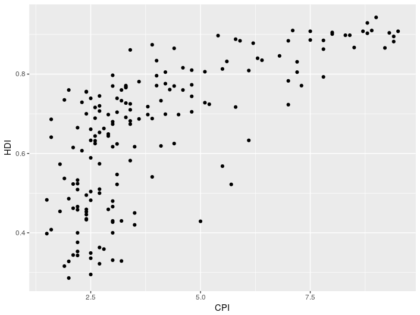
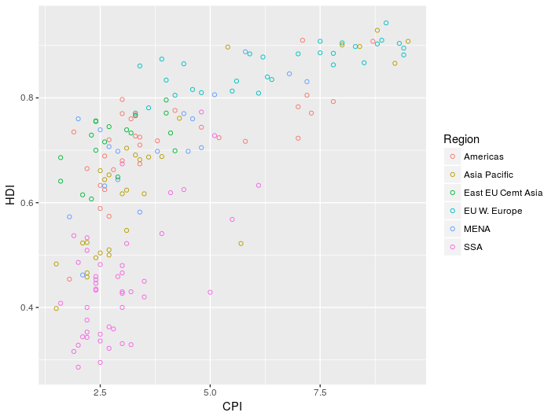
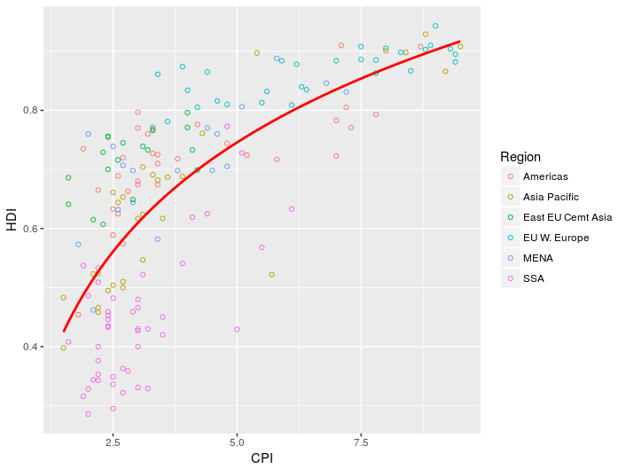
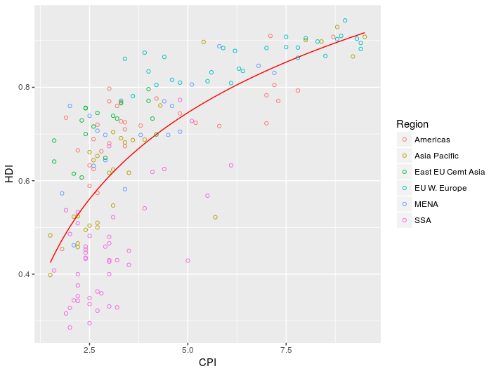

# Advanced graphing with ggplot2

In this section we will recreate a graph from the Economist (shown below), providing a crash course in making beautiful figures with ggplot2.


This was originally used as a challenge in the Harvard tutorial available [here](http://tutorials.iq.harvard.edu/R/Rgraphics/Rgraphics.html).
It is well worth checking out that tutorial to get a better understanding of the steps used here to build up the graph.

As we progress we will also introduce some new concepts in *R* which are useful beyond there relevance to making this graph.

## Obtaining the data

We can load the data the graph is based on directly from the tutorial website using:

```
econ <- read.csv("https://dww100.github.io/nc3rs-r-tutorial/data/economist.csv")
```

The data is available [here](data/economist.csv) to download and read from the file system if you prefer.

Investigate the data using either the *R Studio* data viewer or using the command:

```
head(econ)
```

The two columns we are most interested in are `CPI` (Corruptions Perception Index) and `HDI` (Human Development Index).

## Create a simple plot 

To create a scatter plot of the data with `CPI` on the x-axis and `HDI` on the y-axis enter the folowing:

```
> ggplot(econ, aes(x = CPI, y = HDI)) +
  geom_point()
```

As in the earlier example the `ggplot` command here creates the plot object and selects the `CPI` and `HDI` columns to be the x and y variables.
`geom_point` then adds the scatter plot layer.
Your plot should look something like the one below.



This looks pretty bland and no distinction has been made between the points representing data different regions of the world.
To brighten the graph up lets color the points based on `Region` and alter the dots to hollow points (as used in the Economist graph).

```
>ggplot(econ, aes(x = CPI, y = HDI)) + 
  geom_point(aes(color = Region), shape = 1)
```




## Adding a trend line

In the Economist graph a line has been added to highlight the relationship between `CPI` and `HDI` to the viewer.
The *geom* used in ggplot2 to add this trend line is `geom_smooth`.

In order to add a trend line, we need to have a model linking changes in `CPI` to `HDI`.
The relationship here is a logarithmic one, mathematically the formula we want to use is `HDI` = log(`CPI`).
In *R* the `=` symbol is used for assignment and `~` is used instead.

Replot the graph with an added trend line using:

```
>ggplot(econ, aes(x = CPI, y = HDI)) + 
  geom_point(aes(color = Region), shape = 1) +
  stat_smooth(method = "lm", formula = y ~ log(x), se = FALSE, color = "red")
```



Compared to the circles, the trend line appears a bit too thick.
Reduce this size using the `size` option:

```
>ggplot(econ, aes(x = CPI, y = HDI)) + 
  geom_point(aes(color = Region), shape = 1, stroke = 1, size = 2.5) +
  stat_smooth(method = "lm", formula = y ~ log(x), se = FALSE, color = "red", size = 0.5)
```



[Next]()
