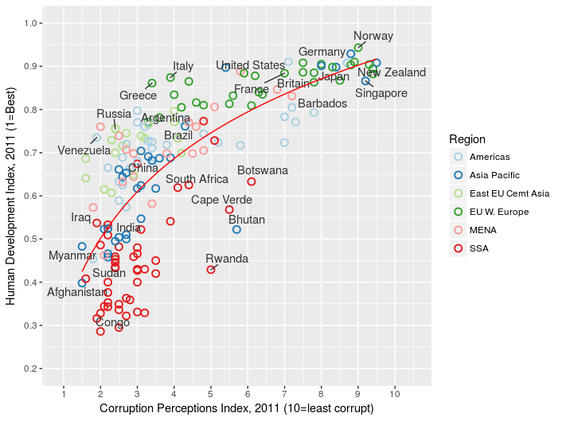

# Improving plot appearance in ggplot2 

Our graph now contains most of the functional data from the Economist graph.
However, it misses the labels added to highlight some countries of note and doesn't yet look very attractive.
Lets put those things right.

## Labelling datapoints

The Economist chose to pick out a subset of countries to highlight.
To do the same in *R* we need to create a list of the datapoints we are interested in.
To create a list in *R* we use the `c` function:

```
>target_countries <- c(
  "Russia", "Venezuela", "Iraq", "Myanmar", "Sudan",
  "Afghanistan", "Congo", "Greece", "Argentina", "Brazil",
  "India", "Italy", "China", "South Africa", "Spane",
  "Botswana", "Cape Verde", "Bhutan", "Rwanda", "France",
  "United States", "Germany", "Britain", "Barbados", "Norway", "Japan",
  "New Zealand", "Singapore"
  )
```

Now we need to pick out the data for these countries from `econ`.
The operator `%in%` can be used to match entries in `econ$Country` that appear in the `target_countries` list we just made.
We can combine this with the `subset` function to get the data we want:

```
>labeled_countries <- subset(econ, Country %in% target_countries)
```

This graph has a lot of closely packed datapoints and we don't want our labels to overlap.
This means we need a non-standard text labelling *geom*.
Load the *ggrepel* library to add this to our environment.

```
library(ggrepel)
```

The *geom* we want is `geom_text_repel`.
As we only want to label the countries in `labeled_countries` we need to set the `data` option for this *geom*, rather than using the default inhereted from `ggplot` (in this case `econ`).
Try creating teh labelled graph using:

```
>ggplot(econ, aes(x = CPI, y = HDI)) + 
  geom_point(aes(color = Region), shape = 1, stroke = 1, size = 2.5) +
  geom_text_repel(aes(label = Country), data = labeled_countries, force = 10) +
  stat_smooth(method = "lm", formula = y ~ log(x), se = FALSE, color = "red", size = 0.5) 
```


## Polishing the appearance

Now all we need to do is improve the aesthetics of our graph.
In this step we will combine a few tweaks; Adjusting and labelling the the x and y scales and improving the colour scheme used.

So far, we have accepted the default colouring of the points.
An excellent resource for palettes which add clarity to your graphics is [Color Brewer](http://colorbrewer2.org).
Fortunately, many of their colour schemes are built into the packages we have loaded, here we will chose the `Paired` palette.

An improved plot can be produced using the command below. Can you identify the additions which alter each element of the graph?

```
>ggplot(econ, aes(x = CPI, y = HDI)) + 
  geom_point(aes(color = Region), shape = 1, stroke = 1, size = 2.5) +
  geom_text_repel(aes(label = Country), data = labeled_countries, force = 10, color = "gray20") +
  stat_smooth(method = "lm", formula = y ~ log(x), se = FALSE, color = "red", size = 0.5) +
  scale_x_continuous(name = "Corruption Perceptions Index, 2011 (10=least corrupt)",
  limits = c(.9, 10.5),
  breaks = 1:10) +
  scale_y_continuous(name = "Human Development Index, 2011 (1=Best)",
  limits = c(0.2, 1.0),
  breaks = seq(0.2, 1.0, by = 0.1)) +
  scale_colour_brewer(palette="Paired", direction = 1) 
```



In *ggplot2* nearly all aspects of the appearance of your graph can be edited.
Many of the standard things you want to edit (font size, background colour, etc.) are grouped together as part of what is called the `theme`.
Look at the help using `?theme` to see all of the elements of teh plot you can change.
A theme is added to a `ggplot` object in the same way as elements such as *geoms*.

Thankfully, we don't have to edit each element individually.
There are pre-selected themes available. 
Here we use the `theme_minimal` selections and then customize it further.
We add a horizontal grid in line with the y axis tic marks and move the legend to the top of the plot.

```
>ggplot(econ, aes(x = CPI, y = HDI)) + 
  geom_point(aes(color = Region), shape = 1, stroke = 1, size = 2.5) +
  geom_text_repel(aes(label = Country), data = labeled_countries, force = 10, color = "gray20") +
  stat_smooth(method = "lm", formula = y ~ log(x), se = FALSE, color = "red", size = 0.5) +
  scale_x_continuous(name = "Corruption Perceptions Index, 2011 (10=least corrupt)",
  limits = c(.9, 10.5),
  breaks = 1:10) +
  scale_y_continuous(name = "Human Development Index, 2011 (1=Best)",
  limits = c(0.2, 1.0),
  breaks = seq(0.2, 1.0, by = 0.1)) +
  scale_colour_brewer(palette="Paired", direction = 1) +
  theme_minimal() +
  theme(
    legend.position = c("top"),
    legend.direction = "horizontal",
    panel.grid.major = element_line(color = "gray50", size = 0.5),
    panel.grid.minor = element_blank(),
    panel.grid.major.x = element_blank()
  )
```


This is the end of the tutorial.
You now have a rather lovely looking plot and a good approximation of the Economist plot.
You should play with all of the options that have been introduced to you and see if you can improve the likeness (for example adding a title).
