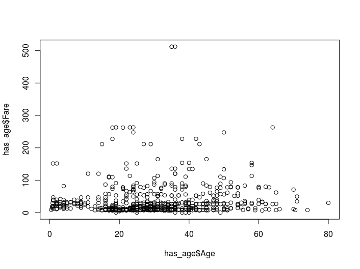
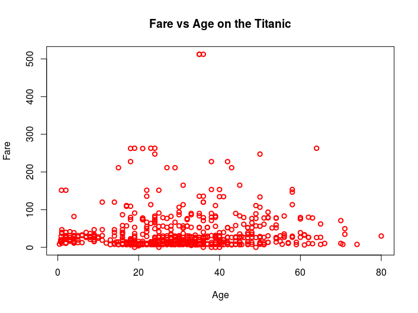
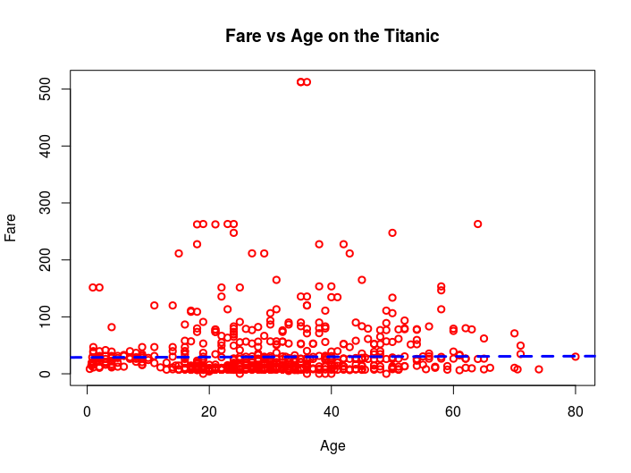
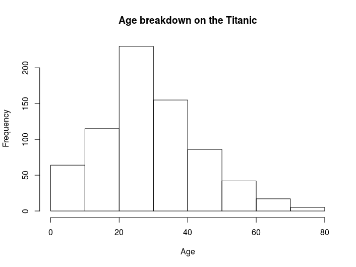
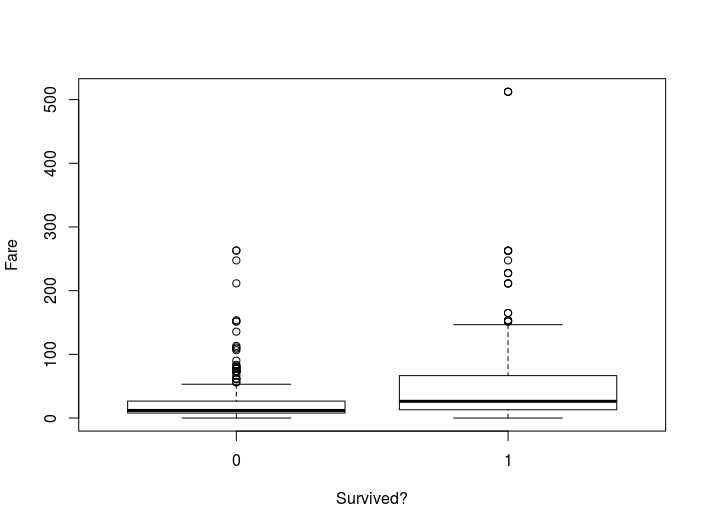

*R* has many graphing options.
Here we introduce those available without any libraries.
This is known as base graphing.
In this introduction, we will only cover how to make quick plots using these functions but they are in fact very flexible and can easily be made publication quality.

## Scatter plot

The simplest plot available in base *R* graphing is the scatter plot.
This is created using the command:

`> plot(has_age$Age, has_age$Fare)`

This command will create the plot below (showing pretty much no coirrelation).



There are many options to alter the appearance of the graph that can be passed to the `plot` function.
Some of the most common are:

| Option     | Description                 |
|------------|-----------------------------|
| col        | Colour                      |
| lwd        | Line width                  |
| xlab       | X-axis label                |
| ylab       | Y-axis label                |
| main       | Main plot title             |

The help for `plot` (found using `?plot`) is less straight forward than usual.
More helpful information on these parameters is available in the *par* and *plot.default* help files.

Here is an example of how to improve the graph appearance:

```
plot(has_age$Age, has_age$Fare,
     col = 'red',
     lwd = 2,
     xlab = 'Age',
     ylab = 'Fare',
     main = 'Fare vs Age on the Titanic'
     )
```



### Challenge

Look up the functions `lm` and `abline` in the help and see if you can add a regression line to the plot to get something like this:



Now we can be even more certain there is not trend ;)

[Example answer](example-scripts/basic_scatter.R)

## Histogram

Another plot that base graphics can produce simply is the histogram.
This is created using the `hist` command:

`> hist(has_age$Age, xlab ='Age')`



## Box plot

An example of a slightly more complicated graph available in base graphing is the box plot.

`> boxplot(has_age$Fare ~ has_age$Survived, xlab='Survived?', ylab='Fare')`


