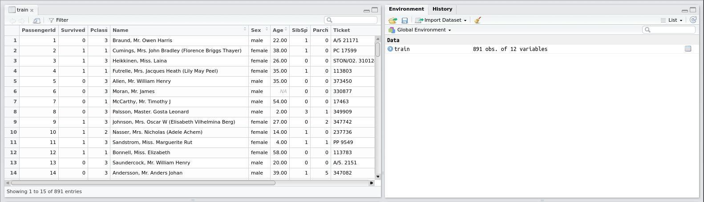
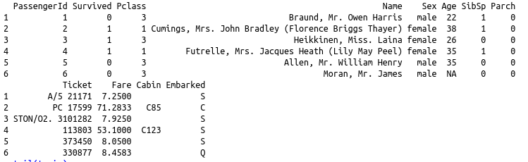
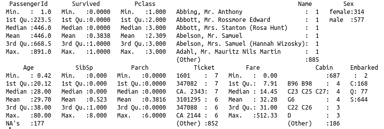

# Getting data from a file

In order to work on real data the first thing we need to learn is how to read from files.

## Working directory

The working directory is the where *R* looks when we give it a file name, and where it will save things when we do that.

Let's see what the current working directory is:

`> cwd()`

In OS X or Linux the result should look like:

`[1] "/home/your_username/"`

On Windows more like:

`[1] "C:\Users\your_username"`

It is a good idea to use a separate directory for all of your projects.
To change the working directory you can either use the command `setwd` or the **Files** tab of the bottom right pane in R Studio.

To do the latter, navigate to the folder you want to use for this tutorial (you can create a new one using the *New Folder* option if you wish).
Then go to the *More* option and select *Set As Working Directory*. You will see the `setwd` command used appears in the **Console**.

## Reading a file

Download the file [titanic-train.csv](data/titanic-train.csv) and save it into your working directory.
This data was the training set for the [Kaggle Titanic challenge](https://www.kaggle.com/c/titanic/data).

`> train <- read.csv('titanic-train.csv')`

You should now see an entry for `train` in the **Environment** pane under the **Data** heading.
Click on this line and a new pane will appear above the **Console** showing the contents of the `train` variable as a table, something like this:



## Examining the data

You can use the commands `head` and `tail` to view the first or last six lines of the data:

`> head(train)`



Notice how when more columns are provided in the data than there is space to show the rows are split and referenced using an index/row name - the number before the data on each line.

Try using the help to find out how to show a different number of lines.

The `names` command lists all of the columns in the data:

```
> names(train)

[1] "PassengerId" "Survived"    "Pclass"      "Name"        "Sex"         "Age"         "SibSp"      `
[8] "Parch"     "Ticket"      "Fare"        "Cabin"       "Embarked"
```

A quick overview of the data can be obtained using `summary`:

`> summary(trains)`



A few things can be seen very easily in this summary - for example there are a lot of *NA*s in the Age column (177 in fact).
In this case this isn't an actual NA in the input file, *R* has recognized a blank line in a numerical column and replaced it with *NA*.

To access all values from a particular column we use the `$` syntax.
To see all the values from the *Age* column use:

`> train$Age`

## Challenge - reading a tab separated file

Download the file [titanic-gendered.csv](data/titanic-gendered.csv).
Try to load it using `read.csv` (remember to copy or move it to your working directory).
Do the columns produced look sensible?
Try using `?read.csv` to get help to read this file correctly.

You will need to know that 'whitespace' characters are often encoded using what are called escape characters.
For example, in *R* the escape character is `\`.
Tab is encoded as `\t`.

[Next]()
