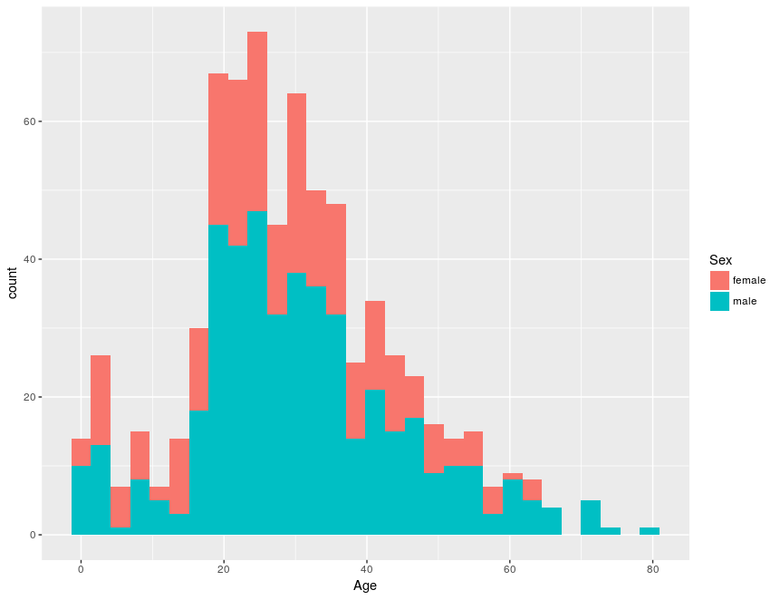

# The ggplot2 library

>The emphasis in ggplot2 is reducing the amount of thinking time by making it easier to go from the plot in your brain to the plot on the page. (Hadley Wickham, 2012)

>Base graphics are good for drawing pictures; ggplot2 graphics are good for understanding the data. (Hadley Wickham, 2012)

The *ggplot2* library is designed to provide a way of building highly informative publication-quality graphics. 
The “gg” stands for “Grammar of Graphics”, and the package is an implementation of a way of thinking about graphic construction outlined in the text by Wilkinson.

Instead of thinking about a single plotting function, *ggplot2* uses a “grammar” approach, linking together elements to form more and more complex sequences that layer on more information or nuance.

The types of elements used include: 

* Data
* Aesthetic mapping
* Geometric object
* Statistical transformations


In this section we will give a couple of very simple graphs to show how this grammar is applied in practice.
The following sections will show how this approach can be used to make a more information packed (and attractive) graph.

### References

1. L. Wilkinson (2006). The grammar of graphics. Springer Science & Business Media.
2. H. Wickham (2010). A Layered Grammar of Graphics. Journal of Computational and Graphical Statistics, 19 (1), pp 3-28 DOI:[10.1198/jcgs.2009.07098](http://dx.doi.org/10.1198/jcgs.2009.07098)

## Package installation

*ggplot2* is not part of standard *R*.
We need to install and load it as a library.
If you didn't install the package along with *R Studio* then use the following command:

```
>install.packages("ggplot2")
```

When this completes load the library using:

```
>library(ggplot2)
```

We will also be using some further additional packages, so issue the following command to add them to your installation:

```
>install.packages(c("scales", "ggrepel", "ggthemes"))
```

## Scatterplot

Let's recreate the scatter plot we made using base graphing.
This uses two commands combined using a `+` operator.
The first `ggplot` produces a plot object and sets up the data elements to be use, the second creates the graphic elements (here the scatter plot points). 
In the jargon of *ggplot2* the command than creates a graphic element direct from data is called a *geom*.

```
>ggplot(has_age, aes(x = Age, y = Fare)) + geom_point()
```


The `ggplot` command is using the following elements of the grammar:

| Argument     | Description                      |
|--------------|----------------------------------|
| data         | Data the plot will be based upon |
| aes          | Aesthetic mappings for plot      |

This schematic shows how we are building up the graph.


It isn't just the *ggplot* command which has aesthetics.
Individual *geoms* have mappings that apply to them alone, for example colour:

```
>ggplot(has_age, aes(x = Age, y = Fare)) + geom_point(aes(color='red'))
```


## Histogram

To create a histogram you use *geom_histogram* rather than *geom_point*.
The aesthetic mapping only requires an `x` value here.
Here we use the fill to show the breakdown of the histogram by gender.

```
>ggplot(has_age, aes(x = Age, fill = Sex)) + geom_histogram()
```



Next we will see how to make more complex plots.
