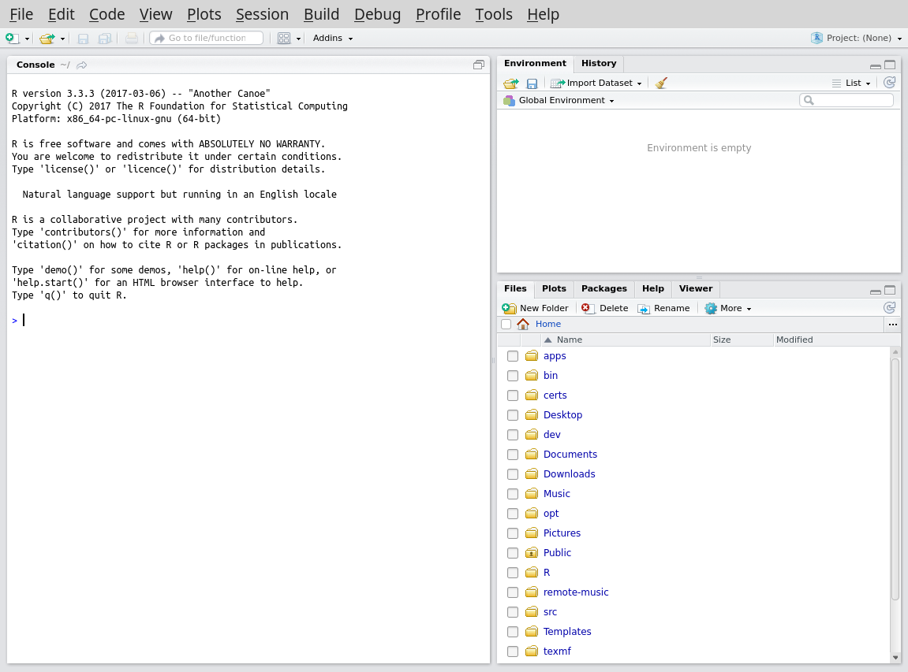

First things first, open up R studio.

You should see something like the above; a window with the panes - a **Console** with some introductory text and a blue `>` prompt, an empty **Enviroment** and a **Files** browser showing the contents of the current directory.

Lets play with some very basic commands.
You need to select the **Console** window and type after the `>` prompt (and type *Enter* after each one to execute the command).

In the rest of the text we will use the following conventions (which echo what you will see in your **Command** window):
*  Commands will be shown with a preceding '>' as a guide to what you should enter - you must **not** type it in as part of the command.
*  The output expected from *R* will be preceded by a number in square brackets (for example `[1]`)

## Basic maths

*R* can be used as a simple calculator.
As in many programming languages, multiply is `*` and divide is `/`.

### Addition
`> 1 + 2`

`[1] 3`

### Division
`> 1 / 2`

`[1] 0.5`

### Multiplication
`> 2 * 2`

`[1] 4`

## Keeping the results of calculations

If this was the only thing *R* could do it would be pretty useless.
It is very useful to to store the results of a command with a name so we can use it again later.
In programming this is called assigning a value in a *variable*.
In *R* there are two commands to assign a value to a variable - `<-` and `=`.
Try the following:

`my_result <- 7 + 3`

Note how there is now no output with square brackets.
To see the value in the variable `x` use the following command:

`print(my_result)`

You will also see that `my_result` has been added to the **Values** section of the **Environment** pane (top right) in R Studio.

## Getting help

We have just used our first *R* function - `print`.
Functions take input surrounded by brackets.

To get more information on how to use a function you can use `?`, for example:

`?print`

You will then see more information in the **Help** tab on the function in the bottom right pane in R Studio.
This is a tab in the pane which initially held the **Files** - this can easily be recovered from tab menu there.
